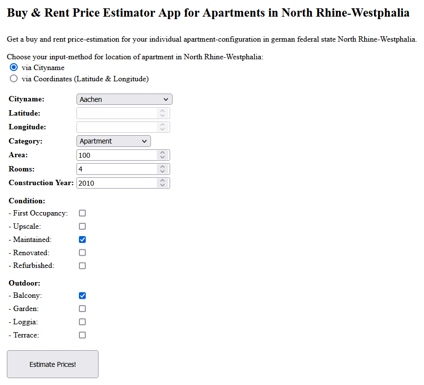
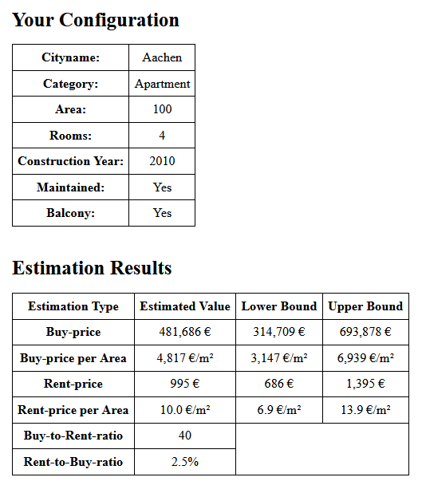

# Buy & Rent Price Estimator for Apartments: Web-Application

Author: <a href="https://github.com/micvolk">Michael Volk</a>

## Overview

* Part of my project *Buy & Rent Price Estimator for Apartments*. Overview and description of the whole project and code of the other project parts can be found in this GitHub repo: [github.com/micvolk/Buy-and-Rent-Price-Estimator-for-Apartments](https://github.com/micvolk/Buy-and-Rent-Price-Estimator-for-Apartments) (webpage version: [micvolk.github.io/Buy-and-Rent-Price-Estimator-for-Apartments](https://micvolk.github.io/Buy-and-Rent-Price-Estimator-for-Apartments))
* Created an easy usable web-application *app.py* for enabling individual apartment-configurations and getting price-estimates for buy & rent.
* *app.py* uses Flask and is deployed to Heroku and accessible for everyone via the internet by calling this link: [price-estimator-apartment-nrw.herokuapp.com](https://price-estimator-apartment-nrw.herokuapp.com)
* Price-estimation is based on the best machine learning model found within the project, each for buy & rent.

## How to run *app.py*
* Download this repo into a directory of your choice.
* Create a new conda environment with configuration defined in *environment.yml*
* To use the app locally with the development server integrated in Flask: Start the Anaconda Prompt with the created environment and make sure that you are in the directory of the module *app.py*, than execute the command 'flask run'. The development server should run now and requests to the app can now be sent to the URL shown in the Anaconda Prompt.
* For deploying the app to Heroku the whole repo has to be indexed by git and the Heroku Command Line Interface (CLI) has to be installed (check also this [Heroku-Intro](https://devcenter.heroku.com/articles/getting-started-with-python?singlepage=true)). Than create a Heroku app via the Heroku-CLI or via the Heroku-Website, which automatically creates a git remote on Heroku. Now push the local git repo to the remote git repo on Heroku to deploy the app in a Heroku container. The app is now accessible for everyone via the internet by calling the URL generated by Heroku.
* Alternatively to using the Heroku-CLI the repo can also be deployed by connecting it via the Heroku-Website with it's GitHub remote.

## How *app.py* works
By calling the link, the user automatically sends a request to the *app.py* deployed to Heroku, which then returns an HTML-input-formular to specify the desired apartment-configuration:
 

After filling out the formular and hitting the submit-button the formular-input is sent to the app via a POST-request. Then a buy & rent price estimation is performed, which is based on the formular-input-data and the deposited best model (*'model_buy.p', 'model_rent.p'*) created by *modeling.py*. The buy- & rent-estimation-values together with associated confidence-intervalls, which are derived from the also deposited 90%-quantile relative error of the model-test-validation, are then returned
via a new HTML-page:

The file *nrwCityCoordinates.csv* was created by module *featureEngineering.py* and is used for mapping formular-input regarding city-name into usable coordinates-information for the model.
Whereas the files *requirements.txt*, *runtime.txt* and *Procfile* are necessary for configurating the correct environment in the Heroku container.